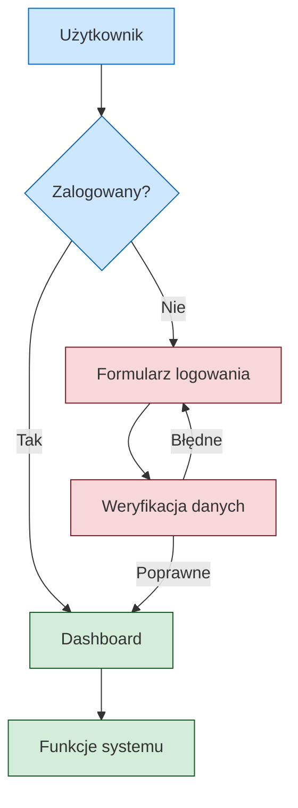

# Sembot - Dokumentacja Biznesowa

Witaj w centrum dokumentacji procesów biznesowych i workflow technicznych Sembot.

## 🎯 Co znajdziesz w tej dokumentacji?

### 📚 Wytyczne i standardy
Poznaj zasady tworzenia dokumentacji biznesowej z naciskiem na diagramy Mermaid i czytelne procesy.

### 🔄 Procesy biznesowe  
Szczegółowe opisy procesów biznesowych z diagramami przepływu, rolami i odpowiedzialnościami.

### ⚙️ Workflow techniczne
Dokumentacja workflow deweloperskich, CI/CD, API i integracji systemowych.

### 🔗 Integracje
Opisy integracji z systemami zewnętrznymi, webhook'i i kolejki komunikatów.

## 🚀 Szybki start

1. **Nowy proces biznesowy?** → Sprawdź [wytyczne dokumentacji](/guides/)
2. **Tworzysz diagram?** → Zobacz [przykłady Mermaid](/examples/mermaid-examples)  
3. **Implementujesz feature?** → Przeczytaj [workflow techniczne](/workflow/)

## 📊 Przykład diagramu Mermaid

## 🎨 Konwencje stylizacji

Wszystkie diagramy używają spójnej palety kolorów:
- 🟢 **Zielony** - procesy zakończone sukcesem
- 🔴 **Czerwony** - błędy i obsługa wyjątków  
- 🔵 **Niebieski** - standardowe kroki procesu
- 🟡 **Żółty** - procesy w trakcie/oczekujące

---

*Dokumentacja jest aktualizowana automatycznie przy każdym deploy na środowisko beta*