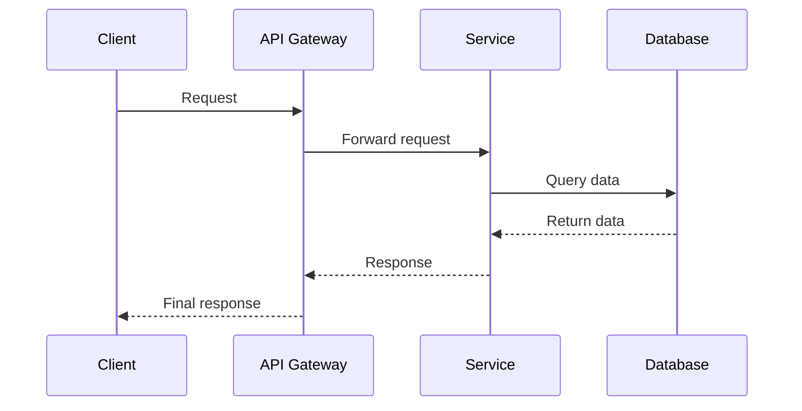
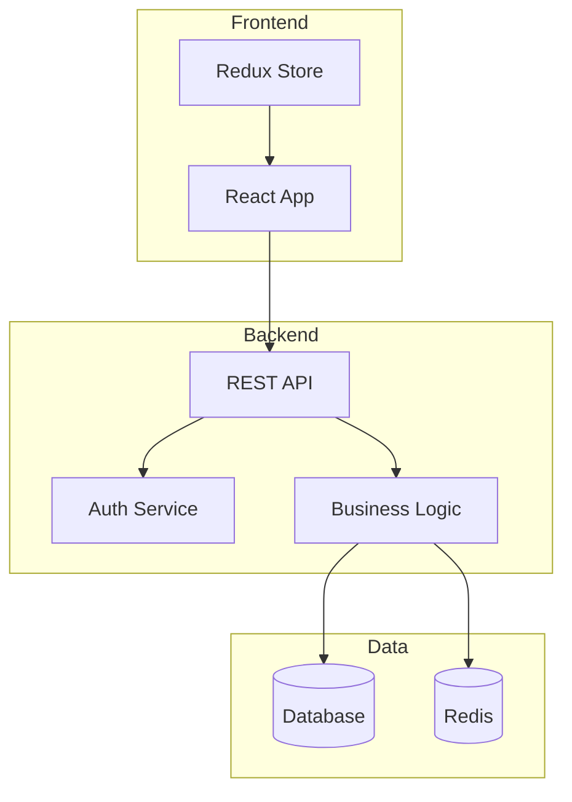
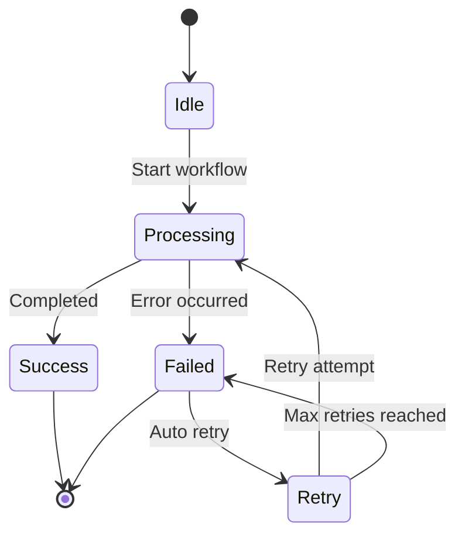
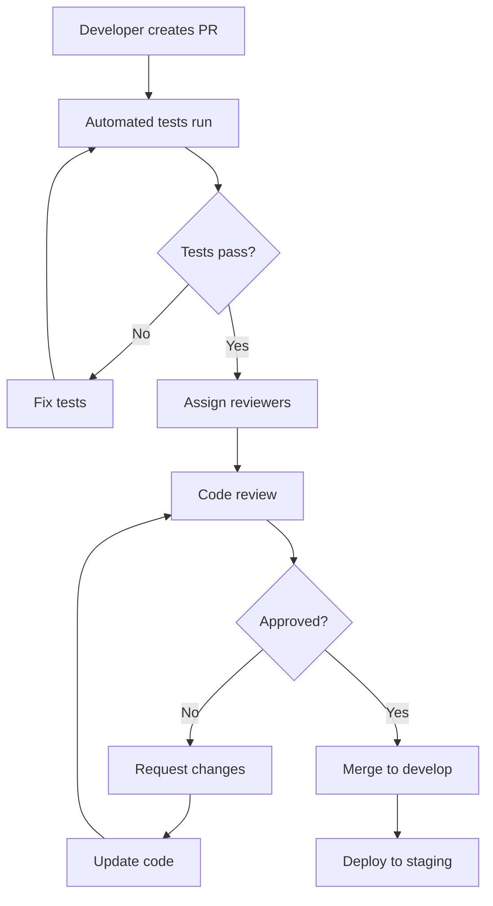
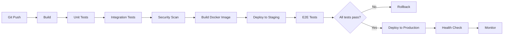
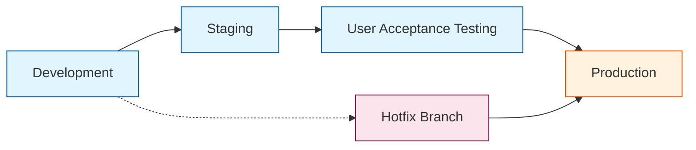
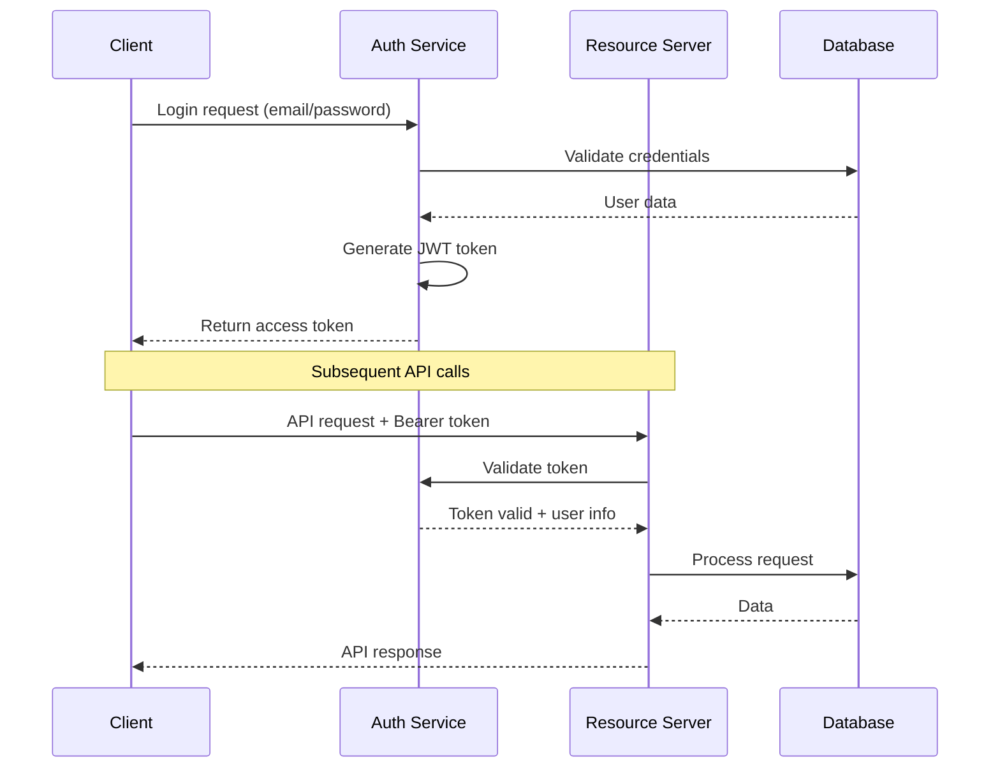
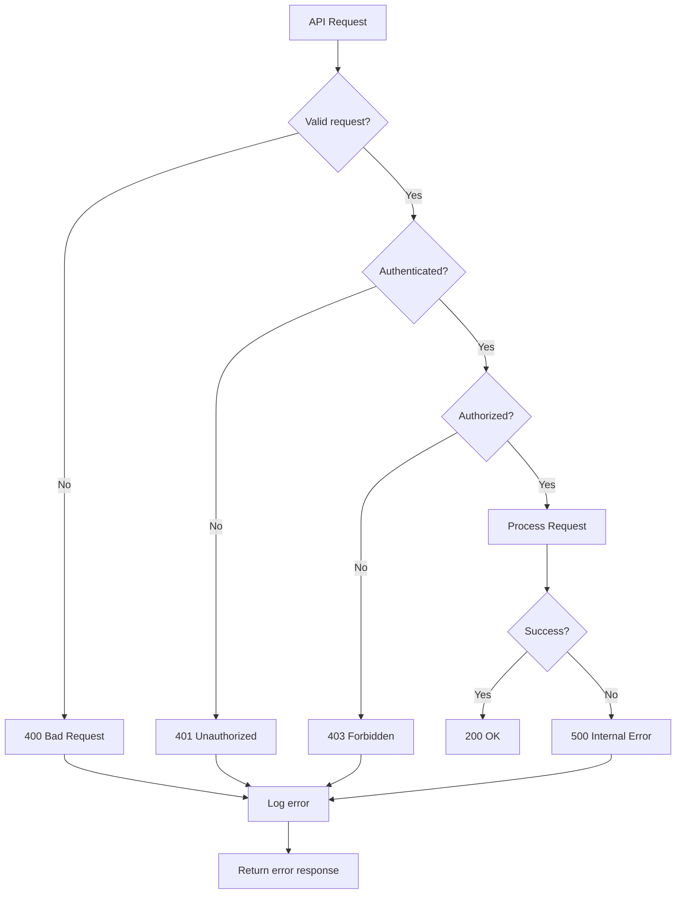
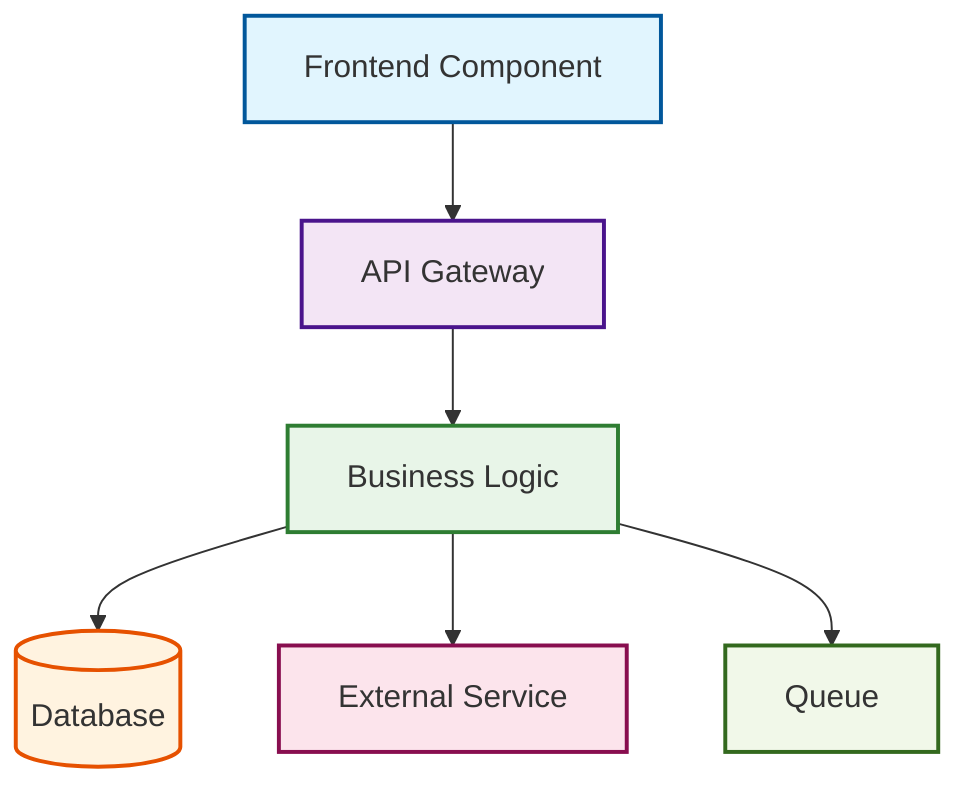

# Workflow Techniczne

## 🔧 Spis treści

### Development Workflow
- [Git Flow](./git-flow.md)
- [Code Review Process](./code-review.md)
- [CI/CD Pipeline](./cicd-pipeline.md)
- [Deployment Strategy](./deployment.md)

### API Workflow  
- [API Design Guidelines](./api-design.md)
- [Authentication Flow](./authentication.md)
- [Error Handling](./error-handling.md)
- [Rate Limiting](./rate-limiting.md)
- [Time Tracking - Technical Workflow](./time-tracking-technical.md) ⭐ **NOWE**

### Data Workflow
- [Database Migrations](./database-migrations.md)
- [ETL Processes](./etl-processes.md)  
- [Data Validation](./data-validation.md)
- [Backup Procedures](./backup-procedures.md)

### Integration Workflow
- [Third-party APIs](./third-party-apis.md)
- [Webhook Handling](./webhook-handling.md)
- [Message Queues](./message-queues.md)
- [Event Sourcing](./event-sourcing.md)

## 🎯 Standardy workflow technicznych

### Każdy workflow musi zawierać:
1. **Diagram sekwencji** - interakcje między komponentami
2. **Diagram architektury** - komponenty i zależności
3. **Konfiguracja** - wymagane ustawienia
4. **Przykłady kodu** - implementacja referencyjna
5. **Testy** - jak testować workflow
6. **Monitoring** - metryki i alerty
7. **Troubleshooting** - typowe problemy i rozwiązania

## 📊 Typy diagramów dla workflow

### 1. Sequence Diagrams - interakcje systemów


### 2. Component Diagrams - architektura systemu  


### 3. State Diagrams - stany workflow


## 🔄 Development Workflow Standards

### Git Flow
```mermaid
gitgraph
    commit id: "Initial"
    branch develop
    checkout develop
    commit id: "Feature A"
    branch feature/new-feature
    checkout feature/new-feature  
    commit id: "Work in progress"
    commit id: "Feature complete"
    checkout develop
    merge feature/new-feature
    commit id: "Prepare release"
    checkout main
    merge develop
    commit id: "Release v1.0"
```

### Code Review Process


## 🚀 Deployment Pipeline

### CI/CD Workflow


### Environment Flow


## 📡 API Workflow Standards

### Authentication Flow


### Error Handling Workflow


## 📋 Checklist nowego workflow

### Przed implementacją
- [ ] Diagram przepływu został zatwierdzony
- [ ] Wszystkie zależności są zidentyfikowane  
- [ ] Metryki i monitoring są zdefiniowane
- [ ] Kryteria akceptacji są jasne
- [ ] Plan testowania jest gotowy

### Podczas implementacji
- [ ] Kod jest zgodny z diagramem
- [ ] Testy jednostkowe pokrywają główne ścieżki
- [ ] Testy integracyjne weryfikują interakcje
- [ ] Logging jest implementowany
- [ ] Error handling jest complete

### Po implementacji  
- [ ] Dokumentacja jest zaktualizowana
- [ ] Metryki są skonfigurowane
- [ ] Alerty są ustawione
- [ ] Runbook jest utworzony
- [ ] Zespół jest przeszkolony

## 🎨 Styling Guide dla Mermaid

### Kolory dla różnych typów komponentów
